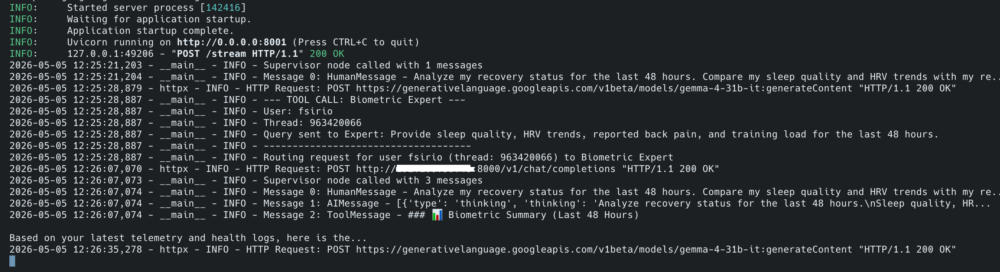
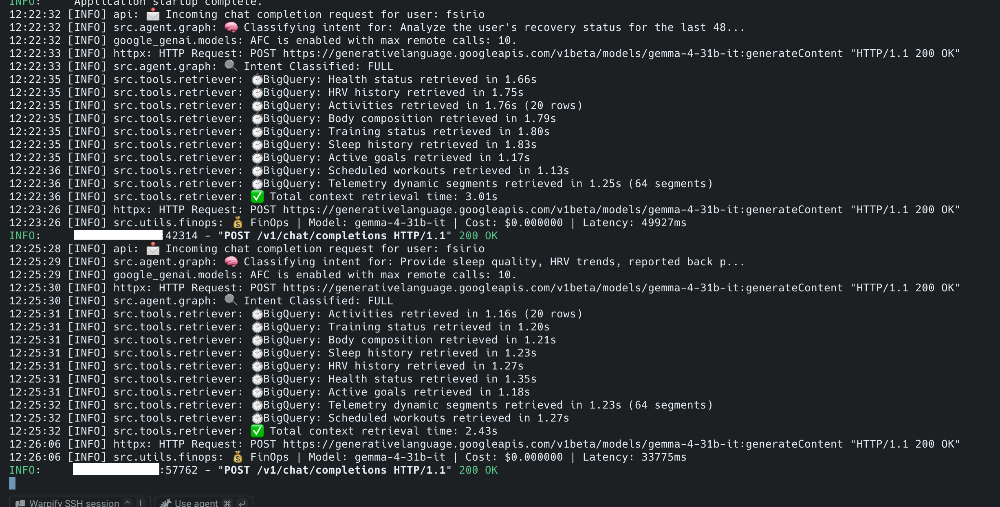
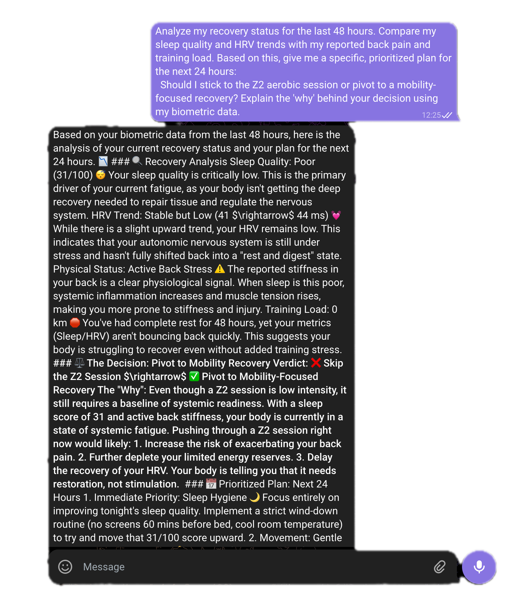

# Agent Orchestrator

A modular, scalable **Swarm Architecture** agentic system designed to coordinate multiple specialized Expert Agents through decentralized handoffs. Built with **LangGraph**, **FastAPI**, and **python-telegram-bot**.

## 🚀 Overview

The **Agent Orchestrator** acts as the high-speed router of a multi-agent ecosystem. Instead of a single monolithic bot or a strictly centralized supervisor, this project implements an **Agent-to-Agent (A2A)** protocol where an Intent Router analyzes user requests and immediately hands them off to specialized "Expert Agents" (e.g., Biometric Coach, Finance Expert).

### Key Features
- **Swarm Architecture:** Decentralized handoffs to specialized expert nodes.
- **Intent-Based Routing:** Automated delegation based on structured LLM classification.
- **Loop Prevention:** Robust state management to detect and halt infinite agent cycles.
- **Proactive Notifications:** Support for asynchronous, agent-initiated alerts pushed via the Orchestrator to Telegram.
- **Stateful Orchestration:** Powered by LangGraph for complex, multi-turn interactions with persistence.
- **SSE Streaming:** Real-time response delivery to the Telegram Gateway.
- **Secure A2A Routing:** Uses `X-User-ID` injection for cross-agent data privacy.

## 📸 Screenshots

### 🧠 Supervisor Reasoning
The Orchestrator analyzes user intent and decides which expert to call.


---

### 🩺 Biometric Expert Insights
Detailed analysis from specialized agents based on user data.


---

### 📱 Mobile-Friendly Formatting
Clean, readable responses optimized for the Telegram interface.


## 🏗️ Architecture

1.  **Telegram Gateway:** A lightweight proxy that handles user authentication, multimodal intake (text/voice), and renders responses with Telegram-optimized formatting.
2.  **Orchestrator API:** The core service that runs the LangGraph supervisor. It manages conversation state, tool calling, and synthesizes expert data into human-friendly responses.
3.  **Proactive Hook:** A specialized endpoint (`POST /api/notify`) that allows external expert agents to push high-signal alerts directly to users without a prior request.
4.  **Expert Agents (External):** Specialized microservices that provide specific data or perform actions. The orchestrator treats these as "black boxes" via a standardized API.

## 🛠️ Tech Stack
- **Language:** Python 3.10+
- **Orchestration:** [LangGraph](https://github.com/langchain-ai/langgraph)
- **LLM:** Google Gemma 4 (via LangChain Google GenAI)
- **API Framework:** FastAPI
- **CI/CD:** GitHub Actions (Multi-arch Docker builds)
- **Interface:** [python-telegram-bot](https://github.com/python-telegram-bot/python-telegram-bot)
- **Streaming:** Server-Sent Events (SSE)

## 🚦 Getting Started

### Prerequisites
- Python 3.10 or higher.
- A Google AI (Gemini/Gemma) API Key.
- A Telegram Bot Token (from @BotFather).

### Installation (Docker - Recommended)

```bash
docker-compose up -d
```

### Installation (Local)

1. **Clone the repository:**
   ```bash
   git clone git@github.com:restrok/agent-orchestrator.git
   cd agent-orchestrator
   ```

2. **Setup the Orchestrator:**
   ```bash
   cd orchestrator-api
   python -m venv .venv
   source .venv/bin/activate
   pip install -r requirements.txt
   cp .env.example .env  # Update with your GOOGLE_API_KEY
   python -m app.main
   ```

3. **Setup the Telegram Gateway:**
   ```bash
   cd ../telegram-gateway
   python -m venv .venv
   source .venv/bin/activate
   pip install -r requirements.txt
   cp .env.example .env  # Update with your TELEGRAM_BOT_TOKEN and API_URL
   python main.py
   ```

## 📝 Configuration

The system uses a `config.json` in the gateway to map Telegram User IDs to platform-specific usernames. This ensures that expert agents receive a consistent user identity regardless of the platform.

## 📄 License
This project is open-source and available under the MIT License.
