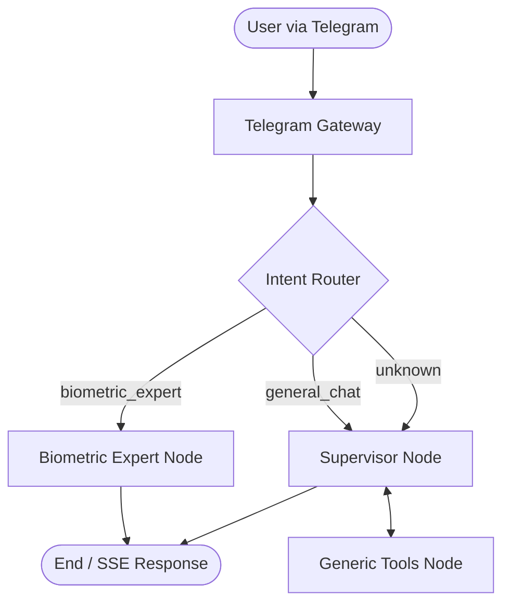

# Telegram A2A Orchestrator: Architecture & Strategic Roadmap

## 1. Executive Summary
This project implements a multi-user Telegram Gateway connected to a central **Agent Orchestrator**. The system follows the **Hub-and-Spoke** architecture, where a high-intelligence Supervisor (Gemma 4) coordinates specialized "Expert Agents" via an Agent-to-Agent (A2A) protocol.

---

## 2. Current Architecture: The "Swarm" Pattern

The system has evolved from a centralized Hub-and-Spoke model to a decentralized **Swarm Architecture**. Instead of a single Supervisor managing all tool calls, a high-speed **Router** identifies the user's intent and hands off the conversation to specialized nodes or expert agents.

### A. Routing Topology
The Orchestrator follows a non-blocking, asynchronous routing flow:



### B. The LangGraph Orchestrator (The Brain)
The orchestrator utilizes a **Stateful Graph** built with LangGraph, optimized for scalability and robustness.

*   **The State (TypedDict)**: A persistent blackboard using native LangGraph reducers (`Annotated[list, add_messages]`) to ensure reliable message history management across turns.
*   **Intent Router**: A dedicated node that uses structured LLM output to classify requests into specific expert domains or general conversation.
*   **Loop Prevention**: A built-in security mechanism that tracks `loop_count` in the state, automatically halting execution if an agent enters an infinite tool-calling cycle (Threshold: 4 loops).

### C. Expert Agent Integration (Decentralized Handoffs)
*   **Direct Handoff**: For specialized intents (like `biometric_expert`), the router bypasses the general supervisor and invokes a dedicated expert node. This reduces latency and token overhead.
*   **A2A Protocol**: Communication between nodes and external expert APIs is strictly **asynchronous**, ensuring the system remains responsive during long-running expert computations.

---

## 3. Technical Implementation Details

### A. State Management
The `AgentState` is defined as a `TypedDict` for performance and compatibility with LangGraph's functional patterns:
```python
class AgentState(TypedDict):
    messages: Annotated[List[BaseMessage], add_messages]
    user_id: str
    thread_id: str
    intent: str
    loop_count: int
    usage_stats: dict[str, Any]
```

### B. Scalable Routing
The `IntentClassifier` is designed to be extensible. Adding a new expert agent (e.g., a "Finance Expert") only requires:
1.  Adding the intent to the `IntentClassifier` Literal.
2.  Defining a specialized node for that expert.
3.  Adding a conditional edge in the `route_to_agent` function.

---

## 4. Future Horizons: Where to Aim Next

### A. Self-Healing & Autonomous Infrastructure (SRE Agent)
Expanding the Orchestrator from a data-provider to an **Action-performer**. If an Expert API returns a 502 error or enters a loop, the Orchestrator could invoke an "Infrastructure Tool" to restart the service or check logs autonomously.

### B. Long-Term Memory (LTM) & RAG
Current memory is limited to the current "Thread". The next evolution involves adding a Vector Database (like Pinecone or ChromaDB) so the Orchestrator remembers context across months (e.g., "You told me in January that your goal was to run a marathon").

### C. Agentic Workflows (The "OpenClaw" Style)
Giving the bot the ability to perform multi-step planning. For example: "Analyze my sleep for the last month, compare it with my Garmin load, and write a training plan for next week in a PDF." The bot would plan these 4 steps and execute them sequentially, verifying each one.

---

## 5. Technical Stack Rationale
*   **Gemma 4 (31B-IT)**: Chosen for its state-of-the-art reasoning and ability to handle complex instructions without "derailing".
*   **FastAPI & SSE**: Ensures the Telegram UX feels modern and responsive.
*   **uv**: High-performance dependency management for fast deployment and local execution.

---
*Documented on May 15, 2026, for the FSirio A2A Project.*
